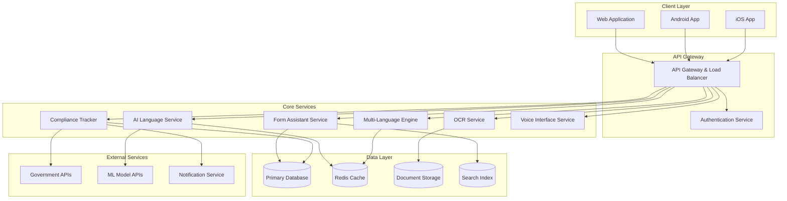

# Design Document: Sahayak AI Platform

## Overview

Sahayak AI is a comprehensive AI-powered platform designed to democratize access to government services for Indian citizens. The platform combines advanced OCR technology, natural language processing, and multi-modal interfaces to bridge the digital divide and simplify complex bureaucratic processes.

The system architecture follows a microservices approach with cloud-native design, supporting web applications, native mobile apps, and offline capabilities. The platform emphasizes accessibility, multi-language support, and inclusive design to serve diverse user groups across India's digital landscape. The architecture supports pay-as-you-go cloud scaling to keep operational costs affordable for public-impact deployment.

## Architecture

### High-Level Architecture



### Technology Stack

**Frontend:**
- **Web Application**: React.js with TypeScript, Progressive Web App (PWA) capabilities
- **Mobile Apps**: React Native for cross-platform development with native modules for OCR
- **UI Framework**: Material-UI with custom accessibility components
- **State Management**: Redux Toolkit with RTK Query for API management

**Backend:**
- **API Gateway**: Kong or AWS API Gateway with rate limiting and authentication
- **Microservices**: Node.js with Express.js and TypeScript
- **Authentication**: JWT tokens with refresh token rotation
- **Message Queue**: Redis for job processing and real-time updates

**AI/ML Services:**
- **OCR Engine**: Tesseract.js for client-side processing, Google Cloud Vision API for server-side
- **Language Models**: Integration with OpenAI GPT-4 or Google PaLM for content explanation
- **Speech Services**: Google Cloud Speech-to-Text and Text-to-Speech APIs
- **Translation**: Google Translate API with custom models for government terminology

**Data Storage:**
- **Primary Database**: PostgreSQL with full-text search capabilities
- **Document Storage**: AWS S3 or Google Cloud Storage with encryption
- **Cache**: Redis for session management and frequently accessed data
- **Search**: Elasticsearch for document and form search functionality

**Infrastructure:**
- **Cloud Platform**: AWS or Google Cloud Platform with India region data residency
- **Containerization**: Docker with Kubernetes orchestration and Horizontal Pod Autoscaler for auto-scaling
- **CDN**: CloudFlare for global content delivery and DDoS protection
- **Monitoring**: Prometheus and Grafana for system monitoring

## Components and Interfaces

### 1. OCR Engine Component

**Purpose**: Extract text from uploaded documents (PDFs, images) with high accuracy across multiple Indian languages.

**Key Features**:
- Multi-language OCR support (Hindi, English, regional languages)
- PDF text extraction and image preprocessing
- Confidence scoring and error detection
- Batch processing capabilities

**Interfaces**:
```typescript
interface OCRService {
  processDocument(file: File, language?: string): Promise<OCRResult>
  extractText(imageData: Buffer): Promise<TextExtraction>
  validateExtraction(result: OCRResult): Promise<ValidationResult>
}

interface OCRResult {
  extractedText: string
  confidence: number
  detectedLanguage: string
  structuredData: DocumentSection[]
  uncertainSections: TextRegion[]
}
```

### 2. AI Language Model Component

**Purpose**: Provide intelligent content explanation, form assistance, and natural language interaction.

**Key Features**:
- Document summarization and explanation with confidence scoring
- Context-aware question answering with human escalation options
- Form field guidance and validation (users retain final control over submissions)
- Multi-language content generation
- AI confidence display and manual correction capabilities

**Interfaces**:
```typescript
interface AILanguageService {
  explainDocument(content: string, userProfile: UserProfile): Promise<Explanation>
  generateFormGuidance(formType: string, fieldName: string): Promise<FieldGuidance>
  answerQuestion(question: string, context: DocumentContext): Promise<AIResponse>
  translateContent(text: string, targetLanguage: string): Promise<Translation>
}

interface Explanation {
  summary: string
  keyPoints: string[]
  actionItems: ActionItem[]
  deadlines: Deadline[]
  language: string
}
```

### 3. Form Assistant Component

**Purpose**: Guide users through government form completion with real-time validation and assistance.

**Key Features**:
- Dynamic form rendering and validation
- Auto-population from user profiles
- Field-level guidance and examples
- Error prevention and correction suggestions

**Interfaces**:
```typescript
interface FormAssistant {
  loadForm(formId: string): Promise<FormDefinition>
  validateField(fieldId: string, value: any): Promise<ValidationResult>
  getFieldGuidance(fieldId: string, context: FormContext): Promise<FieldGuidance>
  autoPopulateForm(formId: string, userProfile: UserProfile): Promise<FormData>
}

interface FormDefinition {
  formId: string
  sections: FormSection[]
  validationRules: ValidationRule[]
  dependencies: FieldDependency[]
}
```

### 4. Compliance Tracker Component

**Purpose**: Monitor deadlines, send reminders, and track compliance status across various government services.

**Key Features**:
- Deadline calculation and tracking
- Personalized reminder scheduling
- Compliance status monitoring
- Calendar integration and notifications

**Interfaces**:
```typescript
interface ComplianceTracker {
  addCompliance(requirement: ComplianceRequirement): Promise<ComplianceItem>
  getUpcomingDeadlines(userId: string): Promise<Deadline[]>
  scheduleReminders(complianceId: string, schedule: ReminderSchedule): Promise<void>
  updateComplianceStatus(complianceId: string, status: ComplianceStatus): Promise<void>
}

interface ComplianceRequirement {
  type: ComplianceType
  description: string
  dueDate: Date
  recurringPattern?: RecurrenceRule
  priority: Priority
}
```

### 5. Multi-Language Engine Component

**Purpose**: Provide comprehensive multi-language support for content, interface, and voice interactions.

**Key Features**:
- Real-time translation of interface elements
- Content localization for regional languages
- Language detection and switching
- Cultural context adaptation

**Interfaces**:
```typescript
interface MultiLanguageEngine {
  translateText(text: string, targetLanguage: string): Promise<Translation>
  detectLanguage(text: string): Promise<LanguageDetection>
  localizeInterface(componentId: string, language: string): Promise<LocalizedContent>
  getLanguagePreferences(userId: string): Promise<LanguagePreferences>
}

interface Translation {
  originalText: string
  translatedText: string
  confidence: number
  detectedSourceLanguage: string
}
```

### 6. Voice Interface Component

**Purpose**: Enable voice input and audio output for accessibility and hands-free interaction.

**Key Features**:
- Speech-to-text conversion in multiple languages
- Text-to-speech with natural voices
- Voice command recognition
- Audio guidance and navigation

**Interfaces**:
```typescript
interface VoiceInterface {
  speechToText(audioData: Buffer, language: string): Promise<SpeechResult>
  textToSpeech(text: string, language: string, voice?: VoiceOptions): Promise<AudioBuffer>
  processVoiceCommand(command: string): Promise<CommandResult>
  enableVoiceNavigation(context: NavigationContext): Promise<VoiceSession>
}

interface SpeechResult {
  transcription: string
  confidence: number
  detectedLanguage: string
  alternativeTranscriptions: string[]
}
```

## Data Models

### User Profile Model
```typescript
interface UserProfile {
  userId: string
  personalInfo: PersonalInformation
  businessInfo?: BusinessInformation
  preferences: UserPreferences
  complianceHistory: ComplianceRecord[]
  documents: UserDocument[]
  createdAt: Date
  updatedAt: Date
}

interface PersonalInformation {
  name: string
  email: string
  phone: string
  panNumber?: string
  aadhaarNumber?: string
  address: Address
  dateOfBirth: Date
  userType: UserType // Student, Freelancer, Business, etc.
}

interface UserPreferences {
  language: string
  accessibilityMode: boolean
  voiceEnabled: boolean
  notificationSettings: NotificationPreferences
  theme: 'light' | 'dark' | 'high-contrast'
}
```

### Document Model
```typescript
interface Document {
  documentId: string
  userId: string
  fileName: string
  fileType: string
  uploadDate: Date
  ocrResult: OCRResult
  documentType: DocumentType
  extractedData: ExtractedInformation
  processingStatus: ProcessingStatus
  tags: string[]
}

interface ExtractedInformation {
  documentNumber?: string
  issueDate?: Date
  expiryDate?: Date
  issuingAuthority?: string
  keyFields: KeyValuePair[]
  identifiedForms: FormReference[]
}
```

### Compliance Item Model
```typescript
interface ComplianceItem {
  complianceId: string
  userId: string
  type: ComplianceType
  title: string
  description: string
  dueDate: Date
  status: ComplianceStatus
  priority: Priority
  reminders: Reminder[]
  relatedDocuments: string[]
  completionDate?: Date
  recurringRule?: RecurrenceRule
}

interface Reminder {
  reminderId: string
  scheduledDate: Date
  reminderType: ReminderType
  message: string
  sent: boolean
  sentDate?: Date
}
```

### Form Definition Model
```typescript
interface FormDefinition {
  formId: string
  formName: string
  version: string
  governmentAgency: string
  category: FormCategory
  sections: FormSection[]
  validationRules: ValidationRule[]
  helpContent: HelpContent[]
  supportedLanguages: string[]
}

interface FormSection {
  sectionId: string
  title: string
  description: string
  fields: FormField[]
  conditionalLogic?: ConditionalRule[]
}

interface FormField {
  fieldId: string
  fieldType: FieldType
  label: string
  placeholder?: string
  required: boolean
  validationRules: ValidationRule[]
  helpText?: string
  options?: FieldOption[]
}
```

## Correctness Properties

*A property is a characteristic or behavior that should hold true across all valid executions of a system—essentially, a formal statement about what the system should do. Properties serve as the bridge between human-readable specifications and machine-verifiable correctness guarantees.*

### Property 1: OCR Accuracy and Multi-Language Support
*For any* document uploaded in supported languages (Hindi, English, Tamil, Telugu, Bengali, Marathi, Gujarati, Kannada), the OCR_Engine should extract text with at least 95% accuracy and properly handle all supported file formats (PDF, JPG, PNG, TIFF).
**Validates: Requirements 1.1, 1.2, 1.5, 3.4**

### Property 2: Document Processing and Structuring
*For any* successfully processed document, the Document_Processor should structure extracted text into meaningful sections and flag uncertain sections when OCR confidence is below threshold.
**Validates: Requirements 1.3, 1.4**

### Property 3: AI Explanation Generation
*For any* processed document containing complex terms, the AI_Language_Model should generate simplified explanations that maintain factual accuracy while identifying key action items, deadlines, and requirements.
**Validates: Requirements 2.1, 2.2, 2.3, 2.4**

### Property 4: Multi-Language Interface and Content
*For any* supported language selection, the platform should display all interface elements and generate all explanations in the user's chosen language, with the ability to switch languages at any time.
**Validates: Requirements 2.5, 3.2, 3.3, 3.5**

### Property 5: Form Assistance and Validation
*For any* government form interaction, the Form_Assistant should provide field-by-field guidance, perform real-time validation with immediate error feedback, auto-populate known information, and prevent submission of incomplete forms.
**Validates: Requirements 4.1, 4.2, 4.3, 4.4, 4.5, 11.1**

### Property 6: Compliance Deadline Management
*For any* compliance requirement added to the system, the Compliance_Tracker should calculate correct deadlines, schedule reminders at specified intervals (30, 7, 1 days), prioritize urgent items, maintain calendar views, and handle recurring requirements.
**Validates: Requirements 5.1, 5.2, 5.3, 5.4, 5.5**

### Property 7: Domain-Specific Processing (GST, License, PAN, Tax)
*For any* domain-specific document (GST, license, PAN, tax), the system should extract relevant information, provide domain-specific guidance and validation, track domain-specific deadlines, and generate appropriate explanations.
**Validates: Requirements 6.1, 6.2, 6.3, 6.4, 6.5, 7.1, 7.2, 7.3, 7.4, 7.5, 8.1, 8.2, 8.3, 8.4, 8.5, 9.1, 9.2, 9.3, 9.4, 9.5**

### Property 8: User Profile Personalization
*For any* user profile type (student, freelancer, business owner), the system should maintain complete profile information, provide personalized recommendations, customize compliance tracking, capture interaction data for learning, and display personalized dashboards.
**Validates: Requirements 10.1, 10.2, 10.3, 10.4, 10.5**

### Property 9: Error Prevention and Knowledge Management
*For any* error detection scenario, the system should provide specific correction guidance with examples, identify common mistakes, maintain a searchable knowledge base of solutions, and perform comprehensive validation before submissions.
**Validates: Requirements 11.2, 11.3, 11.4, 11.5**

### Property 10: Cross-Platform Functionality and Synchronization
*For any* platform (web, Android, iOS), the system should provide full functionality with responsive design, maintain data synchronization across platforms, preserve session continuity during device switches, and ensure consistent user experience.
**Validates: Requirements 12.1, 12.2, 12.3, 12.4, 12.5**

### Property 11: Accessibility and Voice Interface
*For any* accessibility feature activation, the system should support speech-to-text and text-to-speech in all supported languages, enable hands-free navigation, display accessibility-enhanced UI elements, and comply with WCAG 2.1 guidelines.
**Validates: Requirements 13.1, 13.2, 13.3, 13.4, 13.5**

### Property 12: Offline Functionality and Data Optimization
*For any* offline operation, the mobile app should enable document scanning and OCR processing, automatically sync data when connectivity returns, cache essential content for offline access, queue AI requests for later processing, and optimize data usage in low-bandwidth mode.
**Validates: Requirements 14.1, 14.2, 14.3, 14.4, 14.5**

### Property 13: AI Confidence and Human Override
*For any* AI-generated explanation or recommendation, the system should display confidence scores and enable human escalation when confidence falls below acceptable thresholds, ensuring responsible AI deployment.
**Validates: Requirements 2.1, 2.2, 2.4**

### Property 14: Security and Privacy Compliance
*For any* data handling operation, the system should encrypt data in transit and at rest, enforce data retention policies with India-region data residency, implement role-based access controls with proper authentication, enable complete data deletion upon account removal, and maintain compliance with Indian data protection regulations.
**Validates: Requirements 15.1, 15.2, 15.3, 15.4, 15.5**

## Error Handling

### OCR Processing Errors
- **Low Confidence Text**: When OCR confidence falls below 85%, highlight uncertain sections and request user verification
- **Unsupported Languages**: Gracefully handle documents in unsupported languages with clear error messages and suggestions
- **Corrupted Files**: Detect and handle corrupted or unreadable files with appropriate user feedback
- **Large File Processing**: Implement timeout handling and progress indicators for large document processing

### AI Service Errors
- **API Failures**: Implement retry logic with exponential backoff for external AI service failures
- **Rate Limiting**: Handle API rate limits gracefully with user notifications and queuing
- **Content Moderation**: Filter inappropriate content and handle edge cases in AI-generated explanations
- **Language Detection Failures**: Fallback to default language when automatic detection fails

### Form Processing Errors
- **Validation Failures**: Provide clear, actionable error messages for all validation failures
- **Auto-population Errors**: Handle missing or incomplete user profile data gracefully
- **Submission Failures**: Implement retry mechanisms and save draft functionality for failed submissions
- **Complex Form Logic**: Handle conditional field dependencies and circular references

### Compliance Tracking Errors
- **Date Calculation Errors**: Validate and handle edge cases in deadline calculations (holidays, weekends)
- **Notification Failures**: Implement fallback notification methods (email, SMS, in-app)
- **Recurring Task Errors**: Handle edge cases in recurring compliance requirement calculations
- **External API Failures**: Gracefully handle failures when fetching government deadline information

### Multi-Platform Errors
- **Synchronization Conflicts**: Implement conflict resolution for simultaneous edits across devices
- **Offline-Online Transition**: Handle data consistency during offline-to-online transitions
- **Platform-Specific Failures**: Provide platform-appropriate error handling and recovery mechanisms
- **Session Management**: Handle session expiration and authentication failures gracefully

## Testing Strategy

### Dual Testing Approach

The Sahayak AI platform requires comprehensive testing using both unit tests and property-based tests to ensure reliability across diverse user scenarios and government service requirements.

**Unit Tests Focus:**
- Specific government form validation examples (GST registration, PAN application)
- Edge cases in OCR processing (rotated images, poor quality scans)
- Integration points between microservices
- Error conditions and recovery scenarios
- Platform-specific functionality (mobile camera integration, offline storage)

**Property-Based Tests Focus:**
- Universal properties that hold across all supported languages and document types
- Comprehensive input coverage through randomized test data generation
- Cross-platform consistency validation
- Security and privacy compliance verification
- Performance characteristics under various load conditions

### Property-Based Testing Configuration

**Testing Framework**: Use fast-check for JavaScript/TypeScript components and Hypothesis for Python services
**Test Iterations**: Minimum 100 iterations per property test to ensure statistical confidence
**Test Data Generation**: 
- Random document generation with known text content for OCR accuracy testing
- Synthetic government forms with various field combinations
- Multi-language content generation for translation and explanation testing
- User profile variations covering all supported user types

**Property Test Tagging Format:**
Each property-based test must include a comment tag referencing the design document property:
```javascript
// Feature: sahayak-ai-platform, Property 1: OCR Accuracy and Multi-Language Support
```

### Integration Testing Strategy

**Government Service Integration**: Mock external government APIs for consistent testing while maintaining integration test suites for actual API validation
**Cross-Platform Testing**: Automated testing across web browsers, Android emulators, and iOS simulators
**Accessibility Testing**: Automated WCAG 2.1 compliance testing with screen reader simulation
**Performance Testing**: Load testing for concurrent users and large document processing
**Security Testing**: Penetration testing and vulnerability scanning for data protection compliance

### Continuous Testing Pipeline

**Pre-deployment Testing**: All property tests, unit tests, and integration tests must pass before deployment
**Monitoring and Alerting**: Real-time monitoring of property violations in production with automated alerting
**User Acceptance Testing**: Structured testing with representative users from different demographics and digital literacy levels
**Compliance Auditing**: Regular automated compliance checks against Indian data protection and government security requirements